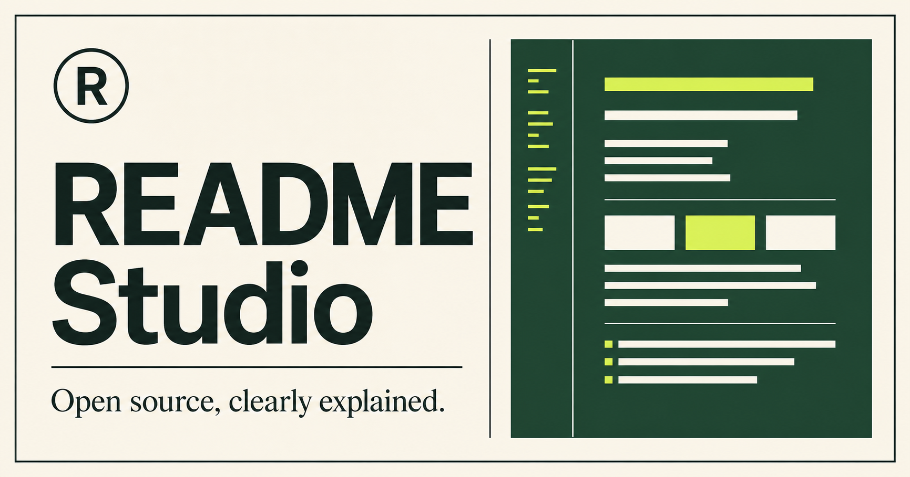

# README Studio

[](https://github.com/pangxueyuan2-creator/oss-readme-studio/actions/workflows/ci.yml)
[](LICENSE)

A privacy-friendly README generator for new open-source maintainers. Fill in a few project details, preview the Markdown live, then copy or download a bilingual `README.md`.



**[Try the live app](https://readme-studio-oss.pangxueyuan2.chatgpt.site)**

## Why this exists

Many useful projects are difficult to try because their first page does not explain the problem, setup, or contribution path. README Studio provides a clear starting structure without accounts, analytics, or server-side processing.

## Features

- Live Markdown generation
- Optional English + Chinese output
- Copy and download actions
- Responsive, keyboard-friendly interface
- Browser-only processing; entered content never leaves the device
- No database, account, API key, or third-party service required

## Run locally

Requirements: Node.js 22.13 or newer.

```bash
git clone https://github.com/pangxueyuan2-creator/oss-readme-studio.git
cd oss-readme-studio
npm install
npm run dev
```

Open `http://localhost:3000`.

## Build

```bash
npm run build
```

## Test

```bash
npm run lint
npm test
```

The test suite covers README generation, bilingual output, fallback content, server rendering, metadata, and the social preview asset. GitHub Actions runs the same checks for every pull request and push to `main`.

## Project status

This is an early, working release. Planned improvements include more README templates, accessible Markdown rendering, and import/export presets. See [ROADMAP.md](ROADMAP.md) and the issue tracker for current work.

## Contributing

Bug reports, documentation improvements, translations, and pull requests are welcome. Read [CONTRIBUTING.md](CONTRIBUTING.md) before contributing.

## Security and privacy

README Studio does not send form content to a backend. If you discover a security issue, follow [SECURITY.md](SECURITY.md) and use GitHub private vulnerability reporting.

## License

[MIT](LICENSE)
